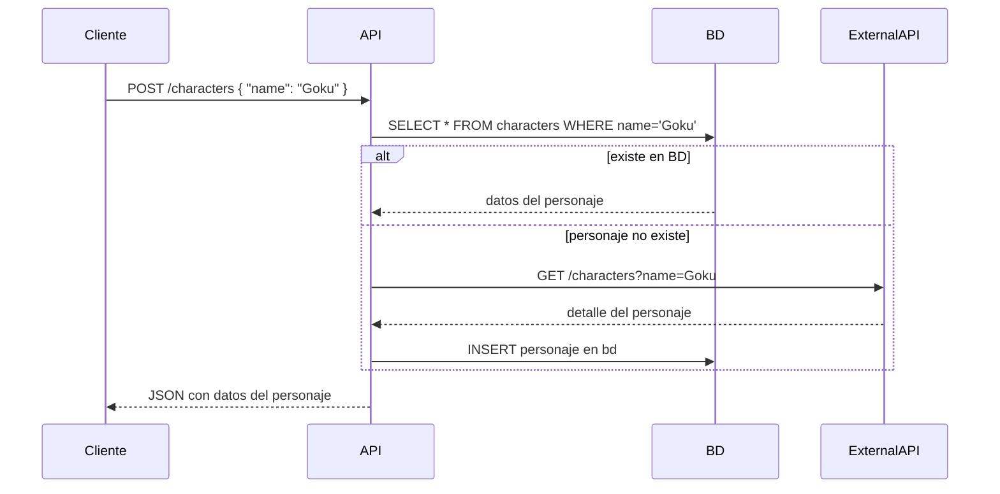

# DragonBall Service

 **Prueba técnica Bastián Gallegos Sepúlveda**

## Requisitos
- Go
- Docker
- Docker Compose

## Instrucciones de ejecución

1. **Con Docker Compose**

   Desde la raíz del proyecto:
   ```bash
   docker compose -f config/docker-compose.yml up --build
   ```
   Esto levantará un contenedor de Postgres y la aplicación Go en el puerto 8080.

2. **Sin Docker Compose** (opcional)

   - Asegúrate de tener un servicio de Postgres corriendo en tu máquina con las credenciales configuradas en las variables de entorno.
   - Exporta las variables de entorno:
     ```bash
     export DATABASE_DSN="host=db user=postgres password=pruebaTecnica dbname=dragonball port=5432 sslmode=disable TimeZone=UTC"
     export API_URL="https://dragonball-api.com/api"
     ```
   - Compila y ejecuta la aplicación:
     ```bash
     go build -o dragonball-service ./cmd
     ./dragonball-service
     ```

## Endpoints

### POST /characters

Crea o recupera un personaje por nombre. Si no existe en la base de datos, lo obtiene de la API externa y lo persiste .

- **URL**: `http://localhost:8080/characters`
- **Método**: `POST`
- **Headers**: `Content-Type: application/json`
- **Body**:
  ```json
  { "name": "Goku" }
  ```

**Ejemplo con `curl`:**
```bash
curl -X POST http://localhost:8080/characters \
     -H "Content-Type: application/json" \
     -d '{"name":"Goku"}'
```

**Respuesta de ejemplo (200 OK):**
```json
{
  "id": "123e4567-e89b-12d3-a456-..",
  "name": "Goku",
  "ki": 1500,
  "maxKi": 2000,
  "gender": "Male",
  "description": "El protagonista de Dragon Ball.",
  "image": "https://...",
  "affiliation": "Z Fighters",
  "deletedAt": null
}
```

## Diagrama de secuencia

A continuación un diagrama de secuencia `GetOrCreate`:



>
